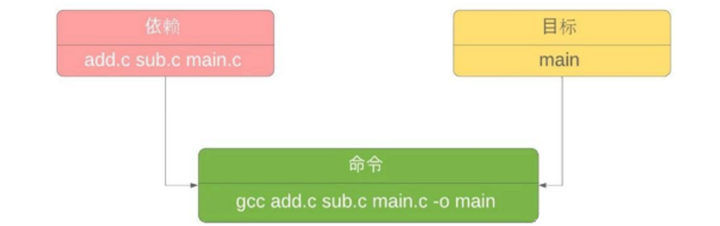
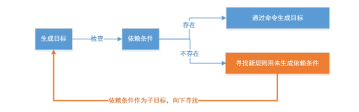

makefile可以简单的认为是一个工程文件的编译规则，描述了整个工程的自动编译和链接的规则。

* 基本组成

  Makefile里主要包含了五个东西：显式规则、隐晦规则、变量定义、文件指示和注释。

  1. 显式规则

     显式规则说明了，如何生成一个或多的目标文件。这是由 Makefile 的写者明显指出，要生成的文件，文件的依赖文件，生成的命令。

  2. 隐晦规则

     由于我们的 make 命名有自动推导的功能，所以隐晦的规则可以让我们比较粗糙地简略地书写 Makefile，这是由 make 命令所支持的。

  3. 变量的定义

     在Makefile中我们要定义一系列的变量，变量一般都是字符串，这个有点像C语言中的宏，当Makefile被执行时，其中的变量都会被扩展到相应的引用位置上。

  4. 文件指示

     其包括了三个部分，一个是在一个 Makefile 中引用另一个 Makefile，就像C语言中的 include 一样；另一个是指根据某些情况指定 Makefile 中的有效部分，就像C语言中的预编译 #if 一样；还有就是定义一个多行的命令。有关这一部分的内容，我会在后续的部分中讲述。

  5. 注释

     Makefile 中只有行注释，和 UNIX 的 Shell 脚本一样，其注释是用“#”字符，这个就像 C/C++ 中的“//”一样。如果你要在你的 Makefile 中使用“#”字符，可以用反斜框进行转义，如：“#”。

* Makefile三要素

  > **语法：**
  > **[目标]: [依赖]**
  > **(tab制表符)[命令]**

  * 目标：规则的目标，可以是 Object File（一般称它为中间文件），也可以是可执行文件，还可以是一个标签；
  * 依赖：是我们的依赖文件，要生成 targets 需要的文件或者是另一个目标。可以是多个，也可以是没有；
  * 命令：make 需要执行的命令（任意的 shell 命令）。可以有多条命令，每一条命令占一行。

  

* Makefile工作原理

  输入make命令：会执行Makefile的第一个目标，如果该目标有依赖，那么也会自动执行依赖的目标

  Makefile执行的具体过程如下图：

  

* Makefile文件夹中的hello项目

  分别编译，再一起链接

  ```bash
  g++ main.cpp -c
  g++ factorial.cpp -c
  g++ printhello.cpp -c
  g++ *.o -o main
  ```

  直接将全部文件编译、链接、运行：

  ```bash
  g++ main.cpp factorial.cpp printhello.cpp -o main
  
  ./main
  ```

  这种方法适用于小型项目。对于大型项目来说，此法编译效率低，这时候make工具就派上用场了。

  当前目录下如果有Makefile可以直接make，否则如果想指定文件需要make -f 文件名。

  1. 版本一：采用最基本的规则

     ```makefile
     hello: main.cpp printhello.cpp factorial.cpp g++ -o hello 	main.cpp printhello.cpp factorial.cpp
     ```

  2. 版本二：使用变量CXX、TARGET 、OBJ，同时采用不同的依赖分别编译

     ```makefile
     CXX = g++
     TARGET = hello
     OBJ = main.o printhello.o factorial.o
     
     $(TARGET): $(OBJ)
     	$(CXX) -o $(TARGET) $(OBJ)
     	
     main.o: main.cpp
     	$(CXX) -c main.cpp
     	
     printhello.o: printhello.cpp
     	$(CXX) -c printhello.cpp
     	
     factorial.o: factorial.cpp
     	$(CXX) -c factorial.cpp
     ```

  3. 版本三：增加了通配符$@ $^ $^，并使用伪依赖.PHONY进行clean操作

     ```makefile
     CXX = g++
     TARGET = hello
     OBJ = main.o printhello.o factorial.o
     
     CXXFLAGS = -c -Wall
     
     $(TARGET): $(OBJ)
     	$(CXX) -o $@ $^
     	
     %.o: %.cpp
     	$(CXX) $(CXXFLAGS) $< -o $@
     	
     .PHONY: clean
     clean:
     	rm -f *.o $(TARGET)
     ```

  4. 版本四：使用了wildcard 和 patsubst

     ```makefile
     CXX = g++
     TARGET = hello
     SRC = $(wildcard *.cpp)#获取当前录下所有的.cpp
     OBJ = $(patsubst %.cpp, %.o, $(SRC))#将$(SRC)中所有的.cpp替换成.o文件
     
     CXXFLAGS = -c -Wall
     
     $(TARGET): $(OBJ)
     	$(CXX) -o $@ $^
     	
     %.o: %.cpp
     	$(CXX) $(CXXFLAGS) $< -o $@
     	
     .PHONY: clean
     clean:
     	rm -f *.o $(TARGET)
     ```

     

* 常见的解析符

  1. 自动化变量

     | 变量      | 解析                                                         |
     | --------- | ------------------------------------------------------------ |
     | $0        | 当前脚本的文件名。                                           |
     | $n（n≥1） | 传递给脚本或函数的参数。n 是一个数字，表示第几个参数。例如，第一个参数是 $1，第二个参数是 $2>。 |
     | $#        | 传递给脚本或函数的参数个数。                                 |
     | $*        | 传递给脚本或函数的所有参数。                                 |
     | $@        | 表示目标文件。                                               |
     | $?        | 表示比目标更新的所有依赖，每个依赖之间以空格隔开             |
     | $$        | 当前 Shell 进程 ID。对于 Shell 脚本，就是这些脚本所在的进程 ID。 |
     | $^        | 表示所有的依赖文件                                           |
     | $<        | 表示第一个依赖文件                                           |

  2. 变量和赋值

     |                            |                            |
     | -------------------------- | -------------------------- |
     | =                          | 执行时再赋值               |
     | :=                         | 定义时就进行赋值           |
     | ?=                         | 表示变量为空时再赋值       |
     | +=                         | 表示将值追加到变量的尾部   |
     | always :=                  | 总是需要被编译的模块       |
     | targets :=                 | 编译目标                   |
     | obj-y :=                   | 编译进内核的文件(夹)列表   |
     | obj-m :=                   | 编译成外部可加载模块的列表 |
     | lib-y := 和 lib-m :=       | 编译成库文件               |
     | subdir-y := 和 subdir-m := | 表示需要递归进入的子目录   |

  3. 内置函数

     | 函数     | 含义                                                         |
     | -------- | ------------------------------------------------------------ |
     | wildcard | cfiles := $(wildcard *.c)，   作用是匹配当前目录（不包含子目录）下所有.c文件，每个文件以空格隔开，然后赋值给cfiles变量 |
     | patsubst | objs := $(patsubst %.c,%.o,$(wildcard *.c))  作用是将当前目录（不包含子目录）下所有的.c文件替换成对应的.o文件，即将后缀为.c的文件替换为后缀为.o的文件，每个文件以空格隔开，然后赋值给objs变量。 |
     | abspath  | path := $(abspath main.c)  作用是获取当前目录下main.c文件的绝对路径（含文件名，结果比如：/work/main.c），然后赋值给path变量。 |

     